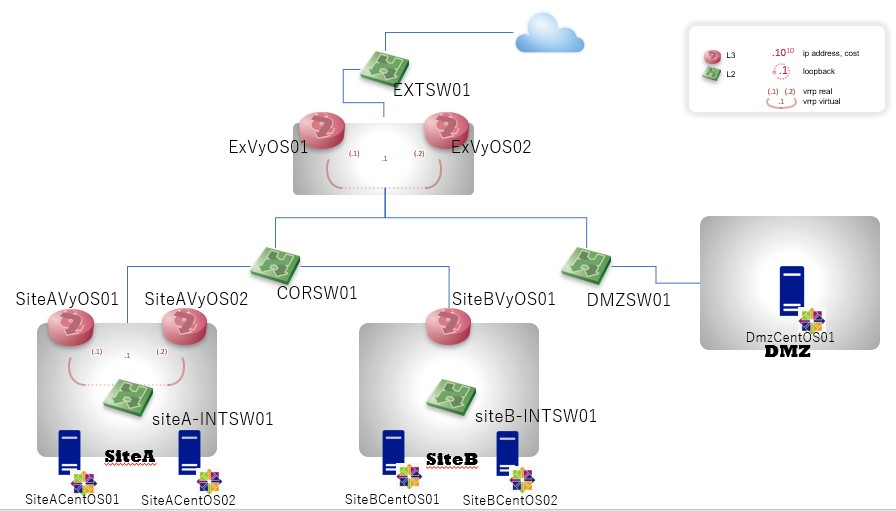

# 概要
高スペックのWindows 10 ProのLaptopがあれば Hyper-V上に以下CampusNetworkを模したLabo物理構成を自動で作成してくれるPowerShellスクリプトです。

自宅にサーバーラックを導入しなくても、OSPF等の動的ルーティングに伴う切り替えやネットワークスペシャリスト試験などで問われる技術要素の動作確認を実施したい場合に構成のスクラップ&ビルドを実施できます。

　※冪等性や例外処理など考慮やテストはしていないので、端末のPowerShellの環境に大切なものがある方は注意してください。
※参考としてThinkPad:T480 Memory:32GiBにて動作を確認しています。

# 前提事項など
 - .\Check_Requireenvironment.ps1 を管理者権限で実施して端末の前提条件を確認してください。 ※本構成の推奨メモリ空き容量は10GiB以上です。
 - 現状はC:\ISO のパスにISOイメージを配置することで動作させています。VyOSとCentOSを変数で指定しているため事前にディレクトリ作成とISOを配置し以下パラメータを変更してから実行してください。
   - 　src/Deploy_VyOS.ps1 の $vyosimagepath = "C:\ISO\vyos-1.1.8-amd64.iso"
   - 　src/Deploy_CentOS.ps1 の　$imagepath = "C:\ISO\CentOS-7-x86_64-DVD-1804.iso"
 - ネットワークアダプターについては現状Wi-fiの決め打ちです。

# 使い方
- 前提条件の確認　※要管理者権限
.\Check_Requireenvironment.ps1
- 構成の作成
.\Build_labo.ps1
- 構成の削除
.\Delete_labo.ps1

# 今後の予定
 - VagrantやAnsible、kickstartを利用して上物のサンプルコンフィグとしてk8sの構成自動化に挑戦