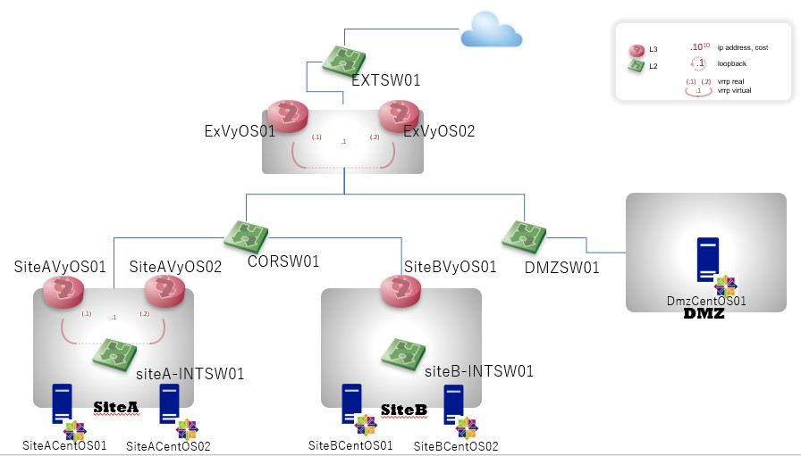

# 概要
高スペックのWindows 11 ProのLaptopがあれば Hyper-V上に以下CampusNetworkを模したLabo物理構成を自動で作成してくれるPowerShellスクリプトです。

自宅にサーバーラックを導入しなくても、OSPF等の動的ルーティングに伴う切り替えやネットワークスペシャリスト試験などで問われる技術要素の動作確認を実施したい場合に構成のスクラップ&ビルドを実施できます。

　※冪等性や例外処理など考慮やテストはしていないので、端末のPowerShellの環境に大切なものがある方は注意してください。
※参考としてThinkPad:T480 Memory:32GiBにて動作を確認しています。

# 前提事項など
 - .\Check_Requireenvironment.ps1 を管理者権限で実施して端末の前提条件を確認してください。 ※本構成の推奨メモリ空き容量は10GiB以上です。
 - 現状は `C:\ISO` のパスにISOイメージを配置することで動作させています。ISOファイルのパスは `config\hyperv-config.json` の `paths` セクションで変更してください。
 - ネットワークアダプターについては現状Wi-Fiの決め打ちです。外部スイッチに使用する物理アダプタ名は `config\hyperv-config.json` の `switches.external.netAdapterName` で変更してください。

# 設定ファイル（config/hyperv-config.json）
各種パラメータは `config\hyperv-config.json` で一元管理しています。主な設定項目は以下の通りです。

## paths
VMのVHDXファイル出力先、および各種ISOファイルのパスを指定します。

| キー | 説明 | 例 |
|------|------|-----|
| `vhdPath` | VHDXファイルの出力先ディレクトリ | `C:\Users\Public\Documents\Hyper-V\Virtual hard disks\` |
| `networkOSIsoPath` | NetworkOS（VyOS）用ISOパス | `C:\ISO\vyos-2026.03-generic-amd64.iso` |
| `serverIsoPath` | Server用ISOパス | `C:\ISO\...SERVER_EVAL_x64FRE_ja-jp.iso` |

## vmNaming
作成するVM名を定義します。`networkOS` と `server` それぞれで、外部/DMZ/サイトA/サイトBの配置ごとにリストを指定します。

| キー | 説明 |
|------|------|
| `networkOS.external` | 外部サイトのNetworkOS VM名リスト |
| `networkOS.siteA` | サイトAのNetworkOS VM名リスト |
| `networkOS.siteB` | サイトBのNetworkOS VM名リスト |
| `server.dmz` | DMZのServer VM名リスト |
| `server.siteA` | サイトAのServer VM名リスト |
| `server.siteB` | サイトBのServer VM名リスト |

## resources
各VMのリソース設定を定義します。

| キー | 説明 |
|------|------|
| `networkOS.vhdSizeGB` | NetworkOS VMのVHDXサイズ（GB） |
| `networkOS.memoryMB` | NetworkOS VMの起動メモリ（MB） |
| `networkOS.dynamicMemory` | NetworkOS VMの動的メモリ有効/無効 |
| `server.vhdSizeGB` | Server VMのVHDXサイズ（GB） |
| `server.memoryMB` | Server VMの起動メモリ（MB） |
| `server.dynamicMemory` | Server VMの動的メモリ有効/無効 |

## switches
仮想スイッチの設定を定義します。

| キー | 説明 |
|------|------|
| `external.name` | 外部スイッチ名 |
| `external.netAdapterName` | 外部スイッチに紐づける物理アダプタ名 |
| `external.enableIov` | SR-IOVの有効/無効 |
| `core.name` / `dmz.name` / `siteAInternal.name` / `siteBInternal.name` | 各内部スイッチ名 |

## networkAdapters
各VMに追加するNICの命名を定義します。

| キー | 説明 |
|------|------|
| `external` | 外部スイッチ接続用NIC名 |
| `core` | コアスイッチ接続用NIC名 |
| `dmz` | DMZスイッチ接続用NIC名 |
| `internal` | サイト内スイッチ接続用NIC名 |
| `default` | デフォルトスイッチ接続用NIC名（日本語OSの場合は「ネットワーク アダプター」） |

## filters
Start/Stop/Remove などの操作対象を `-like` 演算子で絞り込むためのワイルドカードパターンです。

| キー | 用途 | 一致例 |
|------|------|--------|
| `networkOS` | NetworkOS系VMの操作対象 | `ExNetworkOS01-labo` |
| `server` | Server系VMの操作対象 | `DmzServer01-labo` |
| `networkOSVhdx` | NetworkOS系VHDXの削除対象 | `ExNetworkOS01-labo.vhdx` |
| `serverVhdx` | Server系VHDXの削除対象 | `DmzServer01-labo.vhdx` |

## excludedVMs
`filters` に一致していても、操作対象から除外するVM名を定義します。テンプレートVMなどを誤って削除・停止しないための保護設定です。

| キー | 説明 |
|------|------|
| `networkOS` | NetworkOS系の除外対象VM名 |
| `server` | Server系の除外対象VM名 |

# 使い方
- 前提条件の確認　※要管理者権限
.\Check_Requireenvironment.ps1
- 構成の作成
.\Build_labo.ps1
- 構成の削除
.\Delete_labo.ps1
